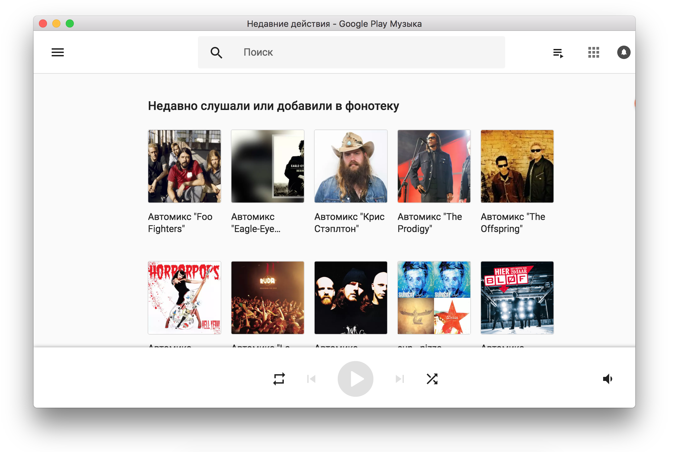

# Perlotto - minimal google music / youtube wrapper wrapper



Perlotto is a minimal wrapper around Google Music and Youtube services
that turnes them into real platers but does not add tons of crap on top.
So, what's inside?

* Google music and Youtube support
* Multimedia keys
* Last.FM scrobbling
* No notifications

That's it.

## Development

```bash
$ npm install
$ npm start
```


## My favorite music service is not supported! What can I do?

Adding new music service ranges from trivial to somewhat
complicated in case this service works with external plugins
(like spotify). Nevertheless, [Google music implementation][1]
can serve as a boilerplate.

You need to be able to reason of several things to get the
full integration:

* How to understand that player page is loaded

  This is `playerLoadedp` function in [inject.js][3] script.

* How to understand that player is playing

  This is `isPlaying` function in [inject.js][3] script.

* How to do play/pause ot switch to the next or previous track

  The javascript to be executed for this commands is defined
  in [content.js][2] script.

* How to get information about current song.

  This is `trackInfo` function in [inject.js][3] script. Please
  note that this information is only required for last.fm stuff
  but who knows if we need it for something else, right?

* And of course you need to be able to make your service work
  inside Perlotto app.

## Packaging

```bash
$ npm run dist
```

## Issues

Whenever you encounter any feel free to raise issues in bugtracker or, what's better,
to solve them and send pull requests.

## License

MIT, except app icon, which was just found on iconfinder. If you are
the owner and don't want it to be there, please contact me.

[1]: https://github.com/can3p/perlotto/tree/master/players/gmusic
[2]: https://github.com/can3p/perlotto/blob/master/players/gmusic/content.js
[3]: https://github.com/can3p/perlotto/blob/master/players/gmusic/inject.js
